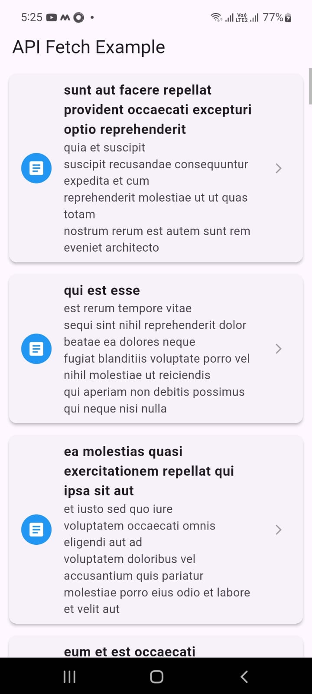

# Flutter API Fetching App

## Overview
This Flutter application fetches data from the [JSONPlaceholder API](https://jsonplaceholder.typicode.com/posts) and displays post titles in a scrollable `ListView`. It includes a loading indicator and handles API errors gracefully.

## Features
- 📡 Fetches data using the `http` package
- 📃 Displays post titles in a `ListView`
- ⏳ Shows a `CircularProgressIndicator` while loading
- ❌ Handles errors with a user-friendly message
- 📌 Clean, structured, and well-documented code

## Installation & Setup
### Prerequisites
- Flutter SDK installed
- Android Studio or VS Code
- A device/emulator to run the app

### Steps to Run the App
1. **Clone the repository:**
   ```sh
   git clone https://github.com/your-repo/flutter-api-fetch.git
   ```
2. **Navigate to the project folder:**
   ```sh
   cd flutter-api-fetch
   ```
3. **Install dependencies:**
   ```sh
   flutter pub get
   ```
4. **Run the application:**
   ```sh
   flutter run
   ```

## Dependencies
- [`http`](https://pub.dev/packages/http) - For handling API requests

## Screenshot

### 📋 Data Display



